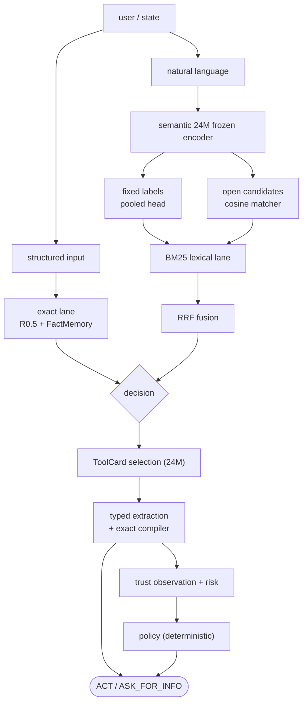
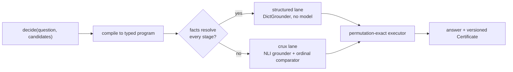

# Architecture

Vey is a set of narrow lanes, each independently measured and replaceable.
Structure, semantics, and trust are separate problems, and one model does not
have to solve all three.

## The lanes

### Exact structured lane

Scores a typed candidate set with hard eligibility masks applied *before*
scoring, online per-candidate reliability (EMA/LCB), and exact recent-history
predicates. It is stateful by design: reliability and history are live, not
decorative. It consumes structured input, not natural language.

### Semantic lane

A frozen 24.1M-parameter sentence encoder
(`mixedbread-ai/mxbai-embed-xsmall-v1`, Apache-2.0) with two heads:

- **PooledClassifier**: a trained softmax head, for a *fixed* label set. More
  accurate than the matcher on trained labels (0.884 / 0.832 / 0.780 on
  Banking77 / CLINC150 / MASSIVE).
- **CandidateMatcher**: cosine over *cached* candidate embeddings, for
  open/novel candidate sets. Because embeddings are cached by text and the query
  is encoded once, a candidate's score is independent of the set it appears in:
  permuting, inserting, or removing candidates changes nothing. Measured score
  drift is exactly 0.0 and winner agreement is 1.000.

That invariance is why Vey has no set-transformer, DeepSets, or candidate
self-attention layer: independent scoring is sufficient.

### Retrieval lane

BM25 and the semantic lane are fused with one fixed Reciprocal Rank Fusion rule
(k=60). The two lanes fail differently out of domain, and fusion beat either lane
alone on every FreshStack technical domain.

### Long-context lane

BM25 sentence selection reduces a long state to ~128 useful tokens *before* the
encoder runs. This is the decision path, not a preprocessing convenience: on a
K-way answer-choice task the selected 128 tokens score 105–147% of the full
context, because mean-pooling a long state dilutes the signal.

### Action compiler

A tool is a typed `ToolCard`. Each slot resolves to exactly one of
`VALUE(span) | MISSING | AMBIGUOUS`. The compiler emits `ACT` only when every
required slot is resolved, every type validates, every enum constraint holds,
and no undeclared argument appears; otherwise `ASK_FOR_INFO` or `REJECT`. It
never invents a value, which is why the unsupported-argument rate is exactly 0.

### Trust lane

The trust layer estimates *risk*; it never emits an action. Exact schema state
decides first, and a calibrated risk estimate gates only the uncertain remainder.
A lane disagreement is a request to run the other cheap lane (`RERUN_CHEAP_LANE`),
never an `ACT`. The policy is deterministic and readable.

## Why the lanes are separate

Each boundary exists because a measurement forced it:

- The exact lane exists because structured decisions should not depend on a
  language model.
- Two semantic heads exist because pooled wins on trained labels and the matcher
  is the only one that generalizes to candidates it never saw.
- BM25 stays a lane because it wins some out-of-domain cases the semantic lane
  loses.
- The action compiler exists because generating structured output is the wrong
  mechanism for exactness.

See [LIMITATIONS.md](LIMITATIONS.md) for what was measured and deliberately not
retained.

## Vey 2: the CRUX lane and the router

Vey 2 adds a semantic decision runtime on top of these lanes. `vey.decide`
routes a `(question, candidates)` decision to the cheapest lane that can answer
it:

- **structured**: every axis/filter in the compiled program resolves against
  explicit numeric/enum candidate facts. A deterministic `DictGrounder`
  executes it. No model loads.
- **crux**: otherwise, a frozen NLI predicate grounder plus a trained
  antisymmetric ordinal comparator ground the language, and the *same*
  permutation-exact executor runs the program. The ~150M backbone loads lazily
  and only when qualitative language grounding is actually required.

The decision is a pure function of the unordered *set* of candidate
consequence-texts: identity-free grounding (the grounder never sees candidate
names), value quantization, and a content-deterministic tie-break give exact
order- and rename-invariance. The learned components ground narrow typed
questions (entailment/contradiction margins, ordinal relation, semantic
distance), and a deterministic microcode executor owns the final decision. No
neural component owns final action utility.

Every decision returns a machine-evidence `Certificate` (versioned
`schema_version`, the typed `decision_program`, per-candidate grounded
`evidence`, and the surviving candidate ids), never generated reasoning text.
If the CRUX comparator artifact is not configured, the crux lane fails closed
with an actionable error; the structured lane still runs with no artifact. See
[CRUX.md](CRUX.md).
